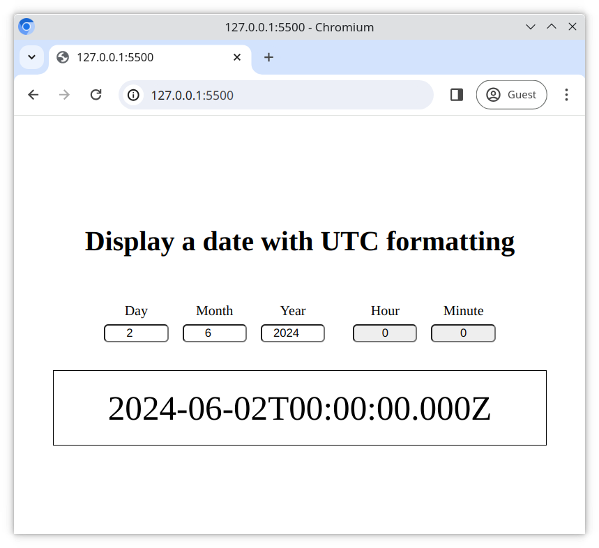

# Handling module exports

Most of the code for this website is complete, however it is missing the module exports.

## Tasks

### Task 1

- Open the website in Live Server and view the **Developer Tools** console
- Fix the `<script>` element in [index.html](./index.html) so that it supports modules
- Check the console again, you should get an error like this;

  > Uncaught SyntaxError: The requested module './elements.js' does not provide an export named 'day' (at updater.js:1:10)

### Task 2

In the following files, follow the paths specified in the `import` statements and use the `export` keyword to correctly export the required objects.

- [js/main.js](./js/main.js)
- [js/init.js](./js/init.js)
- [js/updater.js](./js/updater.js)

## Expected Result

